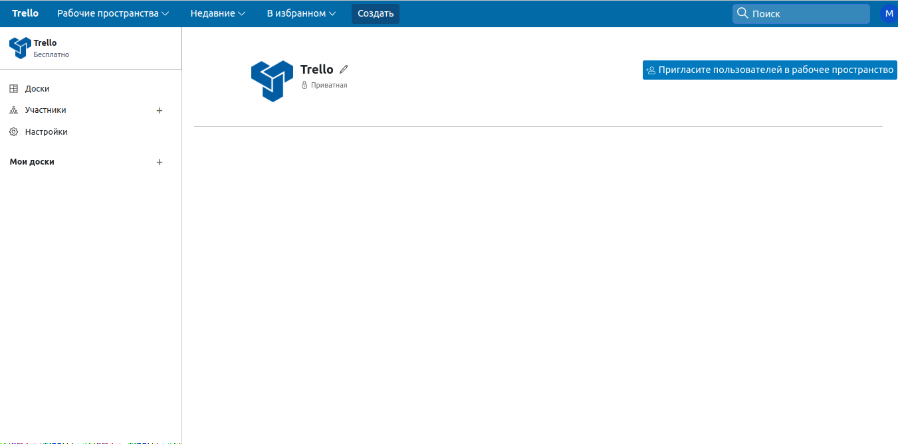

<h1 align="center">🗒📋📆Trello 🔗📊📝 </h1>

#### 🙆🏾 By doing this project, I'm just showing my skill


###  [](https://git.io/typing-svg)

### 🧩 Technology stack

&nbsp;
&nbsp;
&nbsp;


### 🛠 Demo version

* Register Form


* Main Page


* Create Workspace


* Page Workspace



### 👷‍♂️Implemented on the site
- [x] Registration and authorization of users 
    -[x] With mail
    - [ ] With Github
- [x] Working with workspaces 
  - [x] Create WK
  - [x] Update Wk
  - [x] Read Wk


### 👨🏻‍💻 Future Features
* It is expected to fully or partially implement the functionality of the Trello application


### ⚙️Project setup
>***To work with the project, you must have vue instaled !***
```
git clone https://github.com/Mixnosha/Trello.git
cd Trello/TrelloDrf/main
pip install -r requirements.txt
python manage.py migrate
python manage.py runserver

cd ../../trellovue
npm run serve
```

#### Open in Browser link http://localhost:8080/

### 🤝🏻 &nbsp;Connect with Me

<p align="center">

<a href="https://t.me/mixnosha"></a>

</p>